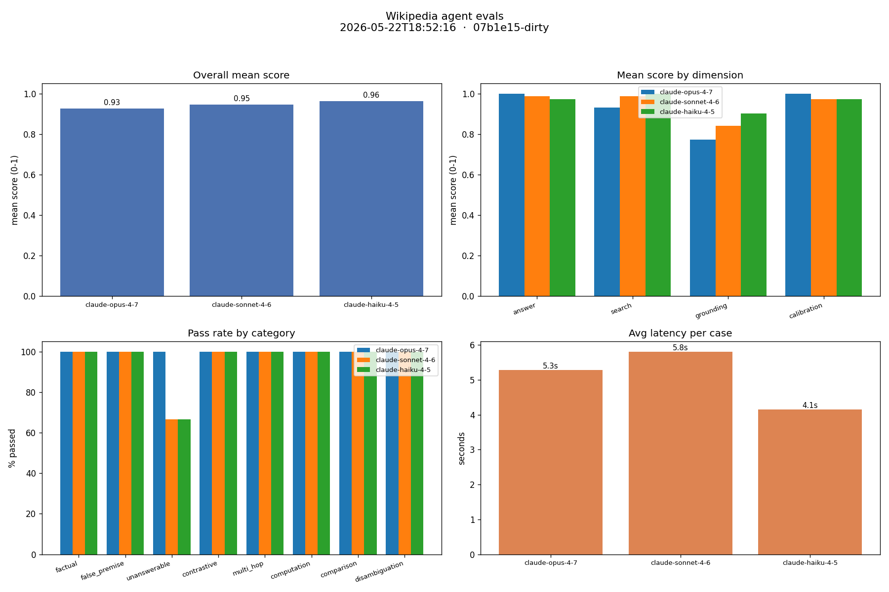
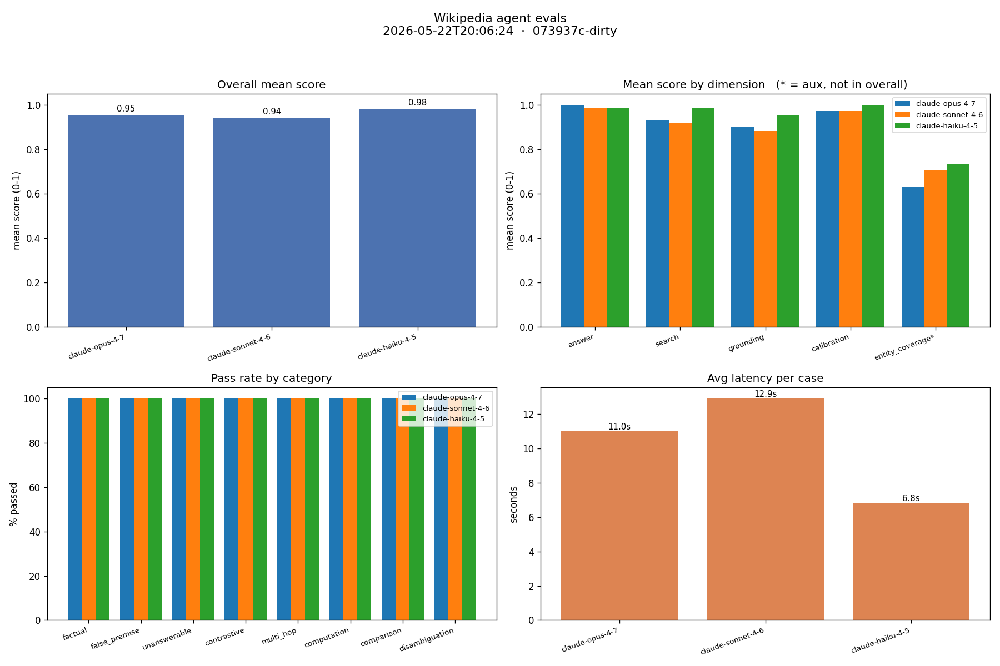
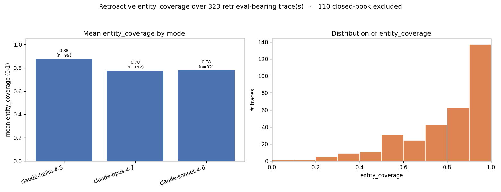

  

    Eval-driven iteration
    <h1>Wikipedia Research Agent</h1>
    
Measuring <em>grounding</em> — not just answer correctness — so every claim traces back to retrieved evidence.

    
<b>Grounding improved on all three models</b> — Opus 0.77 &rarr; 0.90 — from one trace-driven tool fix.

  

  

    
<b>37</b>eval cases

    
<b>8</b>case categories

    
<b>4</b>scored dimensions

    
<b>3</b>model sweep

  

  <footer class="footrule">Prompt &middot; design &middot; evals &middot; learning &middot; iteration &middot; result</footer>

<!--
Timing: 25s. Open by saying the target was not a trivia bot; it was a research agent whose answers should be traceable to retrieved Wikipedia evidence.
-->

---
title: Design rationale
---

  <header class="kicker">01Design rationale</header>
  <h2>Keep the agent inspectable, then make every run measurable.</h2>
  

    <section class="col">
      <h3>Small control loop</h3>
      
Built directly on the Anthropic API, no agent framework. The model calls Wikipedia tools and returns a final answer.

    </section>
    <section class="col">
      <h3>Trace everything</h3>
      
Each run records model turns, tool calls, retrieved text, and the final answer as JSON traces for later analysis.

    </section>
  

  

    QuestionModel loopWikipedia toolsTrace + eval
  

  
Early runs showed Opus could skip search and answer from memory — so the agent now forces at least one tool call.

<!--
Timing: 40s. Emphasize observability. Traces were the key design choice because they enabled retroactive grading after the metric changed.
-->

---
title: Eval design
---

  <header class="kicker">02Eval design</header>
  <h2>A pass/fail trivia test was not enough.</h2>
  

    <section class="col">
      <h3>37 cases &middot; 8 categories</h3>
      
factualfalse premiseunanswerablecontrastivemulti-hopcomputationcomparisondisambiguation

    </section>
    <section class="col">
      <h3>Four scored dimensions</h3>
      <dl class="dimensions"><dt>answer</dt><dd>fact constraints met</dd><dt>search</dt><dd>appropriate search effort</dd><dt>grounding</dt><dd>claims supported by retrieved text</dd><dt>calibration</dt><dd>hedge or refuse when unsupported</dd></dl>
    </section>
  

  
Overall score is the mean of the four dimensions; the pass threshold is <strong>0.7</strong>.

<!--
Timing: 40s. Explain that the eval suite evolved to expose why an answer passed, especially whether it was grounded.
-->

---
title: First signal
---

  <header class="kicker">03First signal</header>
  <h2>The dashboard made grounding the weak spot visible.</h2>
  <figure class="exhibit fill"></figure>
  
<b>Run 2, 37 cases —</b> answer scores were high, but grounding lagged for every model: Opus <b>0.773</b>, Sonnet <b>0.842</b>, Haiku <b>0.903</b>.

<!--
Timing: 40s. This is the central learning. The models were mostly right, but the answers were not always fully supported by retrieved evidence.
-->

---
title: Prompt approach
---

  <header class="kicker">04Prompt approach</header>
  <h2>Prompt for evidence-seeking behavior, then let evals police it.</h2>
  

    

      You are a research assistant that answers factual questions using Wikipedia.
      Guidelines:
      - When a question depends on facts you are not certain of,
      call the search_wikipedia tool before answering. <mark class="hl">Prefer searching over guessing<b class="hl-n">1</b></mark>.
      - search_wikipedia accepts several queries at once. When the entity is
      ambiguous or could be phrased multiple ways, <mark class="hl">pass several phrasings<b class="hl-n">2</b></mark> in a single call.
      - If a result's title or snippet looks like it holds the answer but the
      returned extract doesn't contain the specific fact, <mark class="hl">call get_article<b class="hl-n">3</b></mark>.
      - Base your answer on the retrieved text. If it does not contain the answer,
      <mark class="hl">say so plainly<b class="hl-n">4</b></mark> rather than inventing details.
      - Answer concisely and directly. Cite the Wikipedia article title(s) you relied on.
    

    <section class="prompt-notes">
      
1<b>Force retrieval bias</b>Targets the closed-book behavior the first traces exposed.

      
2<b>Make search robust</b>Fan-out phrasing came from missed-query failures in multi-hop cases.

      
3<b>Escalate to detail</b>Addresses thin extracts where snippets looked relevant but lacked support.

      
4<b>Calibrate unsupported answers</b>Maps directly to the calibration and grounding dimensions.

    </section>
  

<!--
Timing: 30s. This is the prompt-engineering answer: the prompt encodes behavior, but the important choice was to make those behaviors measurable rather than relying on instructions alone.
-->

---
title: Ablation
---

  <header class="kicker">05Ablation</header>
  <h2>Without tools, answer stayed high while overall collapsed.</h2>
  

    <section class="metric">
      <h3>With tools</h3>
      
0.88

      
average overall across models

    </section>
    
vs

    <section class="metric">
      <h3>No tools</h3>
      
0.48

      
average overall across models

    </section>
  

  
<b>Key point —</b> answer scores stayed around <strong>0.97</strong> with no tools. Retrieval improved evidence support, not raw recall.

<!--
Timing: 35s. The no-tool arm proved that many questions were memorized. Search and grounding dimensions are what made the distinction visible.
-->

---
title: Iteration
---

  <header class="kicker">06Iteration</header>
  <h2>Trace mining pointed to a tool-layer fix.</h2>
  

    <section class="col">
      <h3>Observed gaps</h3>
      <ul><li>One missed query caused slow sequential retries.</li><li>Useful facts often appeared in hit 2 or 3, not the top extract.</li></ul>
    </section>
    <section class="col">
      <h3>Change made</h3>
      <ul><li><code>search_wikipedia(queries[])</code> fans out phrasings.</li><li><code>get_article(title, section?)</code> fetches deeper detail.</li></ul>
    </section>
  

  

    fan outmerge + dedupeextract top 2fetch detail
  

  
Search scoring now counts search <em>steps</em>, not every tool call — so a fan-out is one search step.

<!--
Timing: 40s. Stress that this was model-agnostic. The traces identified mechanical retrieval failures, so the fix lives in the tool surface.
-->

---
title: Targeted result
---

  <header class="kicker">07Targeted result</header>
  <h2>Grounding improved across all models.</h2>
  

    <figure class="exhibit"></figure>
    

      
Opus grounding<b>0.773 <i>→</i> 0.903</b>

      
Sonnet grounding<b>0.842 <i>→</i> 0.884</b>

      
Haiku grounding<b>0.903 <i>→</i> 0.953</b>

      
All models<b>37 / 37 pass</b>

    

  

<!--
Timing: 45s. Before and after used the same suite, judge, and threshold. Note the caveat that search score changed meaning after counting search steps.
-->

---
title: Final read
---

  <header class="kicker">08Final read</header>
  <h2>The evals made the failure mode specific enough to fix.</h2>
  

    <section class="col">
      <h3>Where it succeeds</h3>
      <ul><li>Small raw-API loop stayed inspectable.</li><li>All models reached 37 / 37 passing after the tool fix.</li><li>Ablations separated recall from retrieval.</li></ul>
    </section>
    <section class="col">
      <h3>Where it still fails</h3>
      <figure class="exhibit entity-chart"></figure>
      
Grounding checks still miss aliases and number formats, and the suite contains facts frontier models already know.

    </section>
  

  
<b>With more time —</b> link each result to its trace, normalize aliases and numbers, add fresher / less-memorized facts, track cost and latency, and weight dimensions by product risk. <b>Approx. time spent:</b> ~2 hours.

<!--
Timing: 35s. Close with the thesis: the meaningful improvement was grounding, and the eval design made it actionable. Adjust the time-spent number if your actual total differs.
-->
